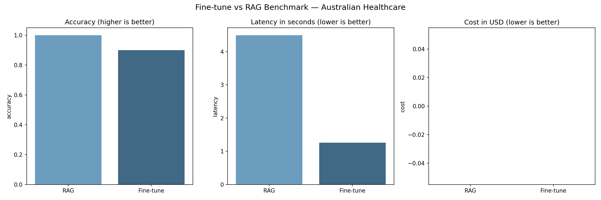

# Fine-tune vs RAG Benchmark 🏥

A scientific benchmark comparing RAG and fine-tuning on Australian healthcare data (Medicare & PBS). Measures accuracy, latency, and cost across both approaches using LLM-as-a-judge evaluation.

---

## Benchmark Results

| Metric | RAG | Fine-tune | Winner |
|--------|-----|-----------|--------|
| Avg Accuracy | **1.0** | 0.9 | RAG |
| Avg Latency | 4.03s | **1.65s** | Fine-tune |
| Model | gpt-4.1-mini | gpt-4.1-mini | — |



---

## Key Findings

**RAG wins on accuracy.**
By grounding responses in source documents, RAG eliminates hallucination risk. Every answer is traceable to a specific document.

**Fine-tune wins on latency.**
Without a retrieval step, fine-tuned models respond 2.5x faster. At scale, this gap widens further.

**At scale, RAG cost increases.**
As document count grows, context size grows, and token costs increase. Fine-tune cost remains constant regardless of knowledge base size.

---

## When to Use Which

| Scenario | Recommendation |
|----------|---------------|
| Accuracy is critical (medical, legal) | RAG |
| Speed is critical (real-time systems) | Fine-tune |
| Knowledge changes frequently | RAG |
| Knowledge is static | Fine-tune |
| Large document base (1M+ docs) | Hybrid |

> Production recommendation: hybrid approach — fine-tune for common static queries, RAG for specific document retrieval.

---

## Tech Stack

| Component | Technology |
|-----------|-----------|
| Vector DB | Pinecone |
| LLM | OpenAI gpt-4.1-mini |
| Evaluation | LLM-as-a-judge |
| Data | Australian Medicare & PBS |
| CI/CD | GitHub Actions |

---

## How to Run

```bash
pip install -r requirements.txt
```

```bash
cp .env.example .env
# Add OPENAI_API_KEY and PINECONE_API_KEY
```

```bash
python -m app.main
```

```bash
pytest tests/ -v
```

---

## Türkçe Açıklama

Avustralya sağlık verileri (Medicare ve PBS) üzerinde RAG ve fine-tuning yaklaşımlarını bilimsel olarak karşılaştıran bir benchmark projesi. LLM-as-a-judge yöntemiyle doğruluk, gecikme süresi ve maliyet ölçülür.

## Ne Yapar?

Bir şirket elindeki domain-specific belgeler üzerinde soru-cevap sistemi kurmak istediğinde iki temel yol vardır. Birincisi RAG: belgeleri vektör veritabanına yükle, sorgu geldiğinde ilgili belgeyi çek, modele bağlam olarak ver. İkincisi fine-tuning: modeli bu belgelerle eğit, artık belgeye ihtiyaç duymadan cevap versin. Bu proje her iki yaklaşımı aynı veri seti üzerinde çalıştırır ve rakamlarla karşılaştırır.

## Temel Bulgular

**Doğrulukta RAG kazanıyor.** Yanıtları kaynak belgelere dayandırdığı için halüsinasyon riski sıfıra yakın. Her cevap belirli bir belgeye izlenebilir. Özellikle sağlık ve hukuk gibi kritik alanlarda bu fark hayat kurtarır.

**Gecikme süresinde fine-tune kazanıyor.** Belge arama adımı olmadığı için fine-tune edilmiş modeller 2.5x daha hızlı yanıt veriyor. Büyük ölçekte bu fark daha da açılır.

**Büyük ölçekte RAG maliyeti artıyor.** Belge sayısı arttıkça her sorguda gönderilen bağlam büyür, token maliyeti yükselir. Fine-tune maliyeti ise bilgi tabanı boyutundan bağımsız olarak sabit kalır.

## Ne Zaman Hangisi Kullanılır?

Doğruluk kritikse RAG seçilir. Tıp, hukuk veya finans gibi alanlarda yanlış cevabın ciddi sonuçları olabilir. Bilgi sık güncelleniyorsa RAG daha avantajlıdır çünkü yeni belgeyi sadece vektör veritabanına eklemek yeterlidir, modeli yeniden eğitmek gerekmez. Hız kritikse ve bilgi statikse fine-tune tercih edilir.

Production önerisi: hibrit yaklaşım. Yaygın ve statik sorgular için fine-tune, spesifik belge erişimi gerektiren sorgular için RAG.

## Teknoloji Stack

- **Vektör DB:** Pinecone — production ortamında en yaygın kullanılan bulut tabanlı vektör veritabanı
- **LLM:** OpenAI gpt-4.1-mini — hem RAG hem fine-tune tarafında aynı model kullanılarak adil karşılaştırma sağlandı
- **Değerlendirme:** LLM-as-a-judge — model çıktılarını klasik string matching yerine GPT ile puanlama yöntemi
- **Veri:** Avustralya Medicare ve PBS sistemi — gerçek production verisiyle (MBS API, PBS ilaç veritabanı) entegre edilebilir
- **CI/CD:** GitHub Actions — her push'ta otomatik test